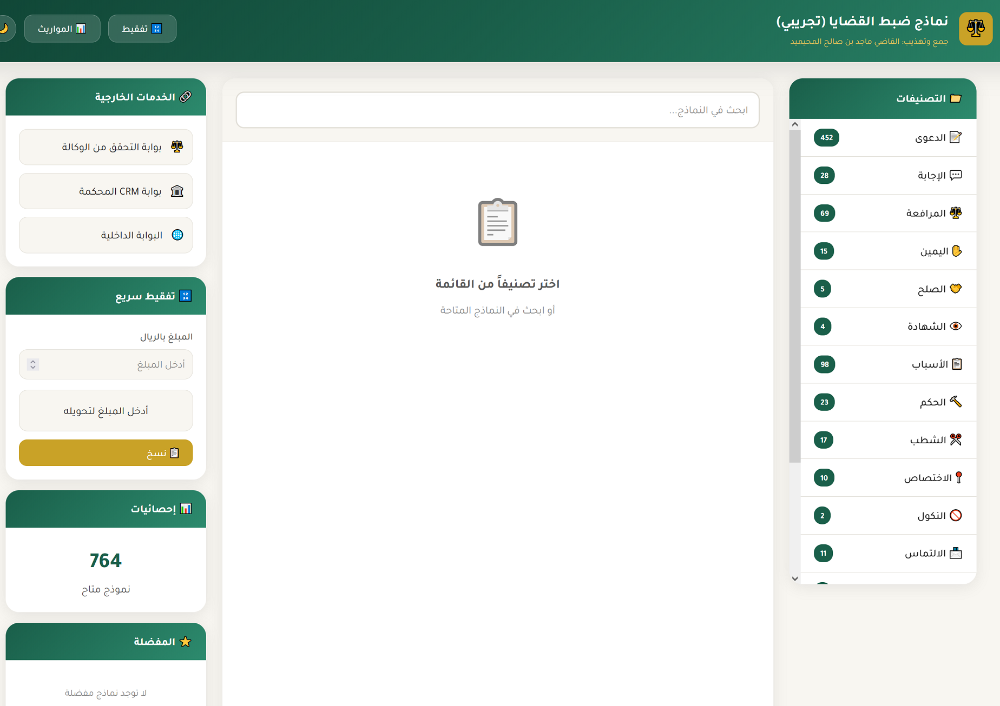
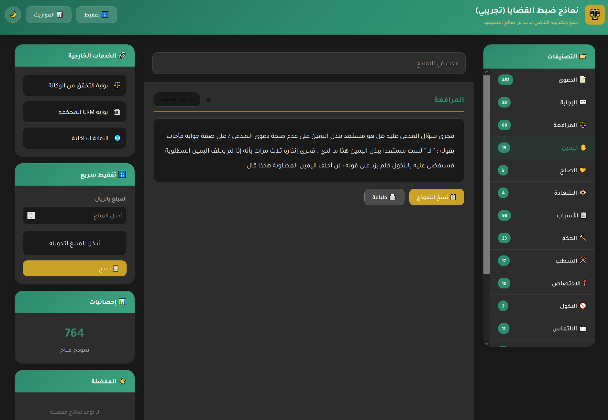
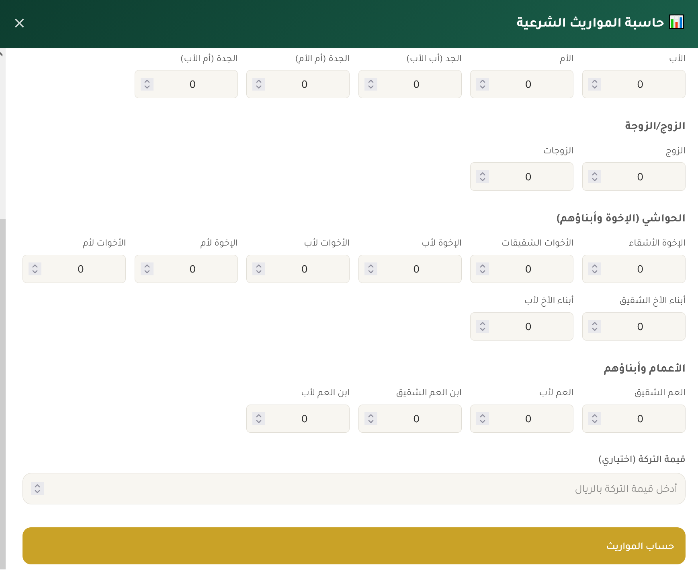
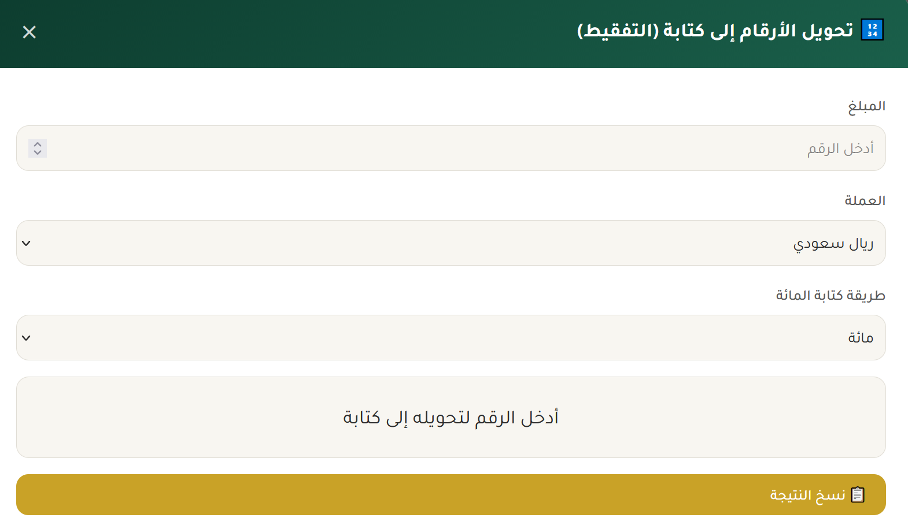
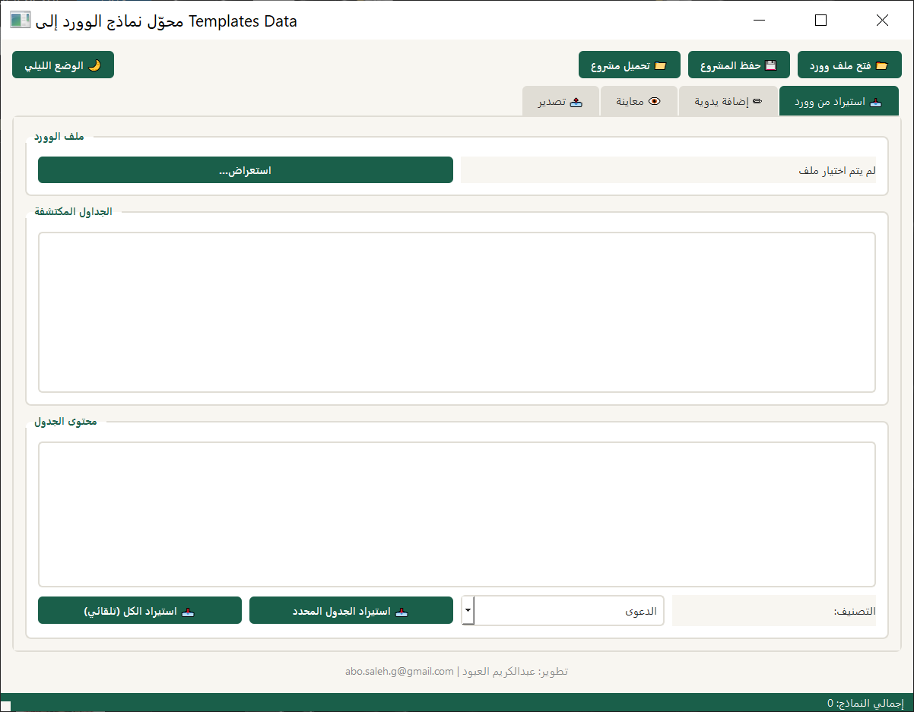

<div align="center">

# ⚖️ نماذج ضبط القضايا

**مجموعة شاملة من النماذج والصيغ القضائية الجاهزة للمحاكم السعودية**

[](https://github.com)
[](LICENSE)
[](https://developer.mozilla.org/en-US/docs/Web/HTML)
[](https://developer.mozilla.org/en-US/docs/Web/JavaScript)

[عرض التطبيق](https://abosalehg-ui.github.io/court-templates-sa) · [الإبلاغ عن مشكلة](https://github.com/abosalehg-ui/court-templates-sa)

</div>

---

## 📋 نظرة عامة

تطبيق ويب متكامل يوفر نماذج وصيغ قضائية جاهزة للاستخدام في المحاكم السعودية، مع أدوات مساعدة متقدمة. التطبيق يعمل بالكامل في المتصفح دون الحاجة لاتصال بالإنترنت.

### ✨ المميزات الرئيسية

- 📝 **نماذج قضائية شاملة** - أكثر من 300 نموذج مصنف
- 🔍 **بحث سريع** - البحث في جميع النماذج
- 🔢 **تفقيط الأرقام** - تحويل الأرقام إلى كتابة (11 عملة)
- 📊 **حاسبة المواريث** - حساب التركات وفق الشريعة الإسلامية
- ⭐ **المفضلة** - حفظ النماذج المستخدمة بكثرة
- 📜 **السجل** - الوصول السريع للنماذج الأخيرة
- 🌙 **الوضع الليلي** - راحة للعين
- 📱 **تصميم متجاوب** - يعمل على جميع الأجهزة
- 🖨️ **طباعة مباشرة** - طباعة النماذج بسهولة

---

## 📂 التصنيفات

| التصنيف | الوصف |
|---------|-------|
| 📝 الدعوى | صيغ رفع الدعاوى |
| 💬 الإجابة | صيغ الرد على الدعاوى |
| ⚖️ المرافعة | صيغ المرافعات |
| 📋 الأسباب | أسباب الأحكام |
| 🔨 الحكم | صيغ الأحكام |
| 👁️ الشهادة | صيغ الشهادات |
| 🤝 الصلح | صيغ الصلح |
| ✋ اليمين | صيغ اليمين |
| 🚫 النكول | صيغ النكول |
| 📜 الكفالة | صيغ الكفالة |
| 📨 الالتماس | صيغ الالتماسات |
| ✂️ الشطب | صيغ الشطب |
| 👤 الغياب | صيغ الغياب |
| 📍 الاختصاص | صيغ الاختصاص |
| 💰 التمويل | صيغ التمويل |
| 🏠 العقارات | صيغ العقارات |

---

## 🚀 التشغيل

### الطريقة الأولى: مباشرة
1. حمّل الملف `index.html`
2. افتحه في المتصفح

### الطريقة الثانية: GitHub Pages
1. فعّل GitHub Pages من إعدادات المخزن
2. ادخل على الرابط: (https://abosalehg-ui.github.io/court-templates-sa)

### إضافة: الأداة المحولة
1. حمّل الملف `wordtotemplates.py`
2. أو لتحميل نسخة EXE لملف تحويل النماذج: (https://drive.google.com/file/d/1RRLDvRrMKzXxz3SV8b5HKvo-j_Mb22mw/view?usp=sharing)

---

## 🛠️ التقنيات المستخدمة

- **HTML5** - هيكل الصفحة
- **CSS3** - التنسيق والتصميم
- **JavaScript** - الوظائف والتفاعل
- **LocalStorage** - حفظ البيانات محلياً
- **Python** - لتحويل نماذج الوورد ل TEMPLATES DATA

---

## 📸 لقطات الشاشة

<div align="center">

| الواجهة الرئيسية | الوضع الليلي |
|:---:|:---:|
|  |  |

| حاسبة المواريث | التفقيط |
|:---:|:---:|
|  |  |

|أداة تحويل جداول الورد إلى بيانات js |
|:---:|
|  

</div>

---

## 📄 هيكل المشروع

```
court-templates-sa/
├── index.html          # الملف الرئيسي
├── README.md           # هذا الملف
├── wordtotemplates.py  # أداة تحويل جداول الورد إلى بيانات js 
├── LICENSE             # رخصة المشروع
└── screenshots/        # لقطات الشاشة
    ├── main.png
    ├── dark.png
    ├── inheritance.png
    └── tafqit.png
    └── WordToTemplates.png
```

---

## 🤝 المساهمة

المساهمات مرحب بها! إذا وجدت خطأ أو لديك اقتراح:

1. افتح Issue جديد
2. أو قدم Pull Request

---

## 📜 الترخيص

هذا المشروع مرخص تحت [MIT License](LICENSE).

---

## 👨‍💻 المطور

<div align="center">

**عبدالكريم العبود**

[](mailto:abo.saleh.g@gmail.com)

</div>

---

## 🙏 شكر وتقدير

- **فضيلة القاضي ماجد بن صالح المحيميد** - جمع وتهذيب النماذج

---

<div align="center">

**⭐ إذا أعجبك المشروع، لا تنسَ إضافة نجمة! ⭐**

</div>
