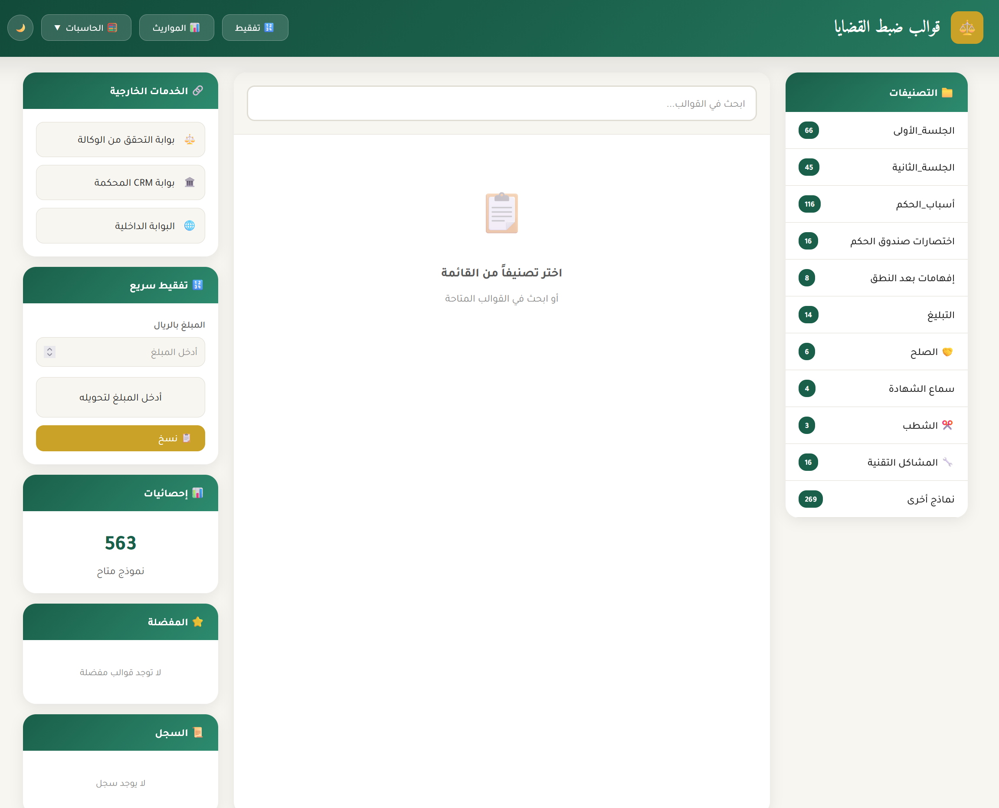
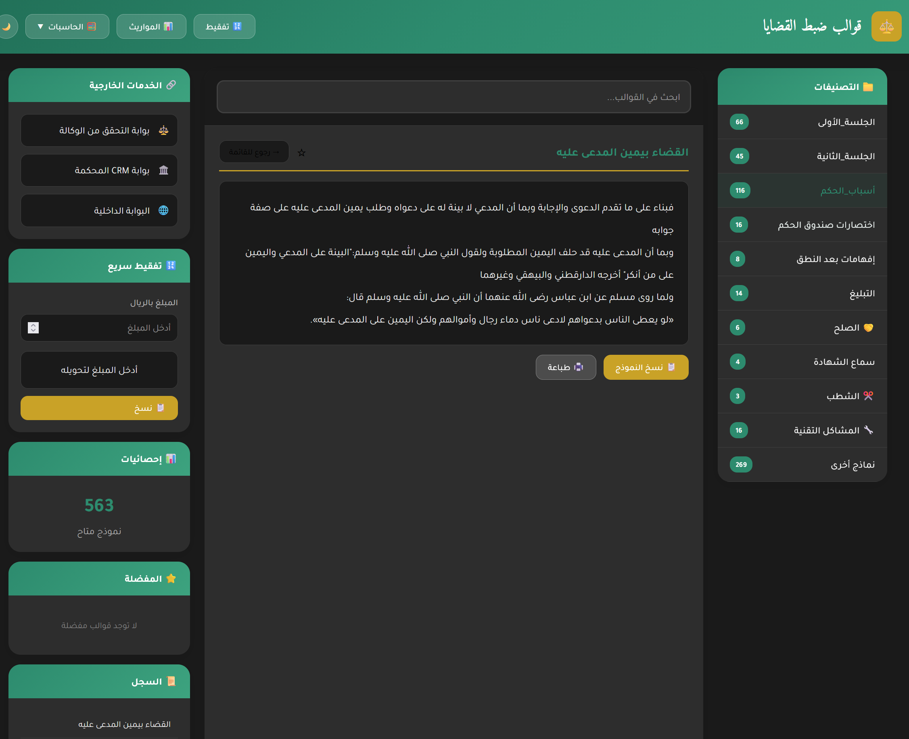
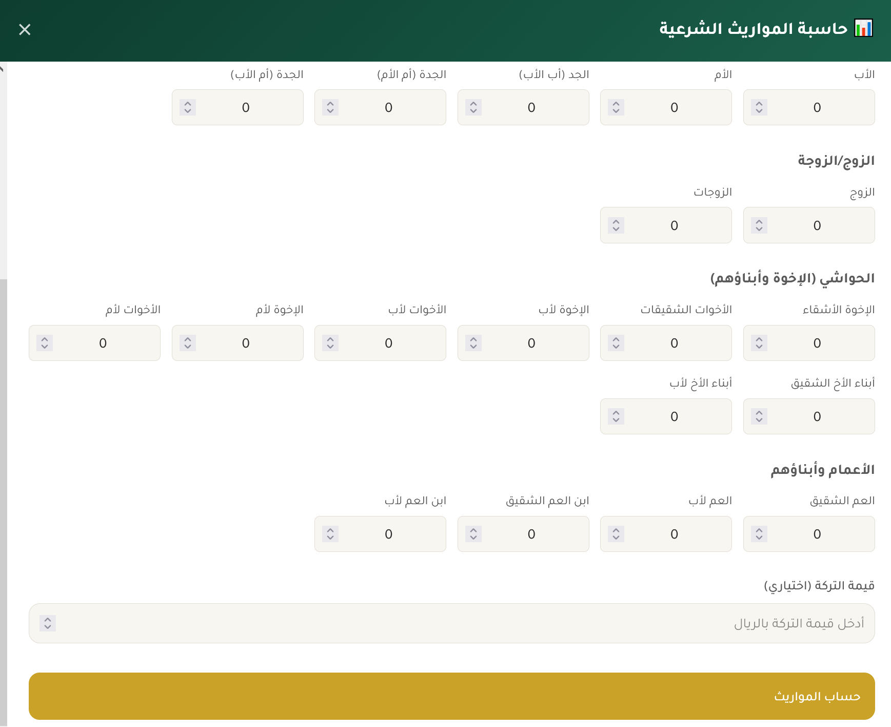
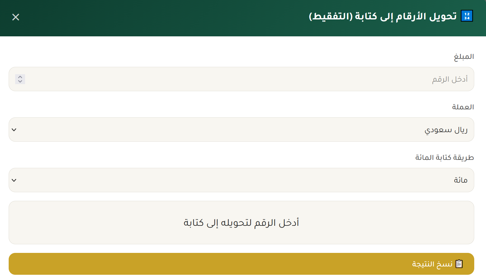
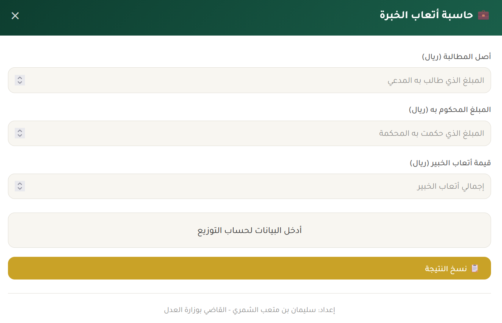
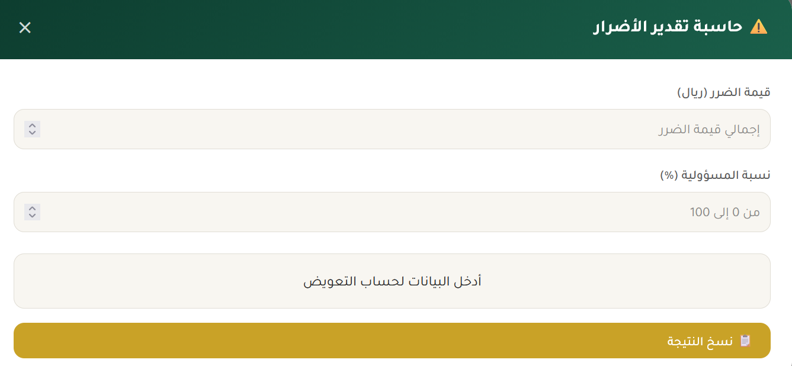
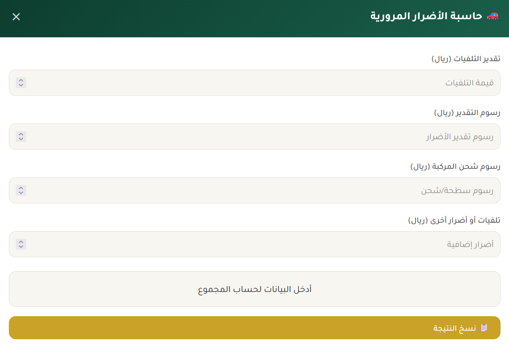
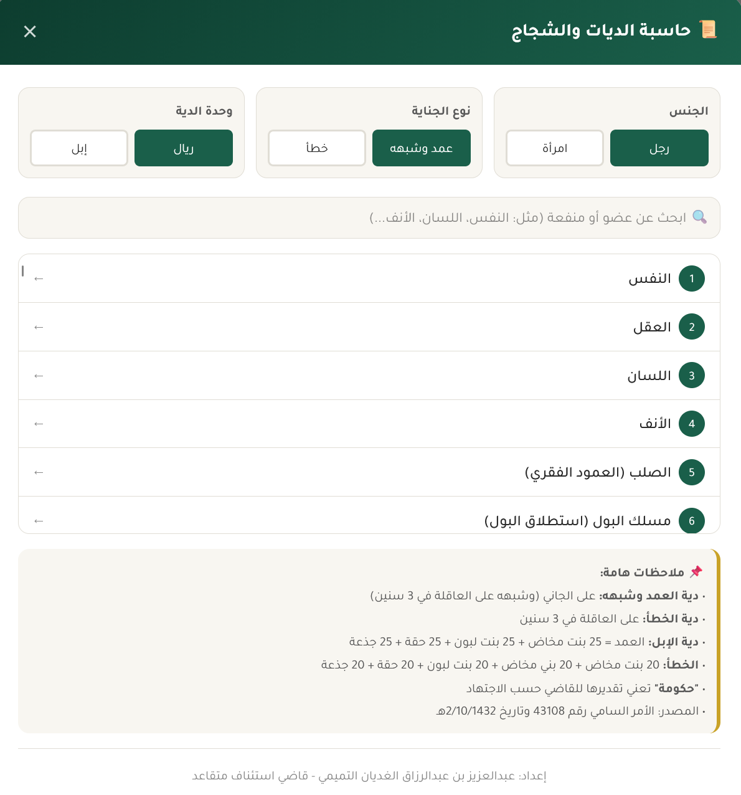
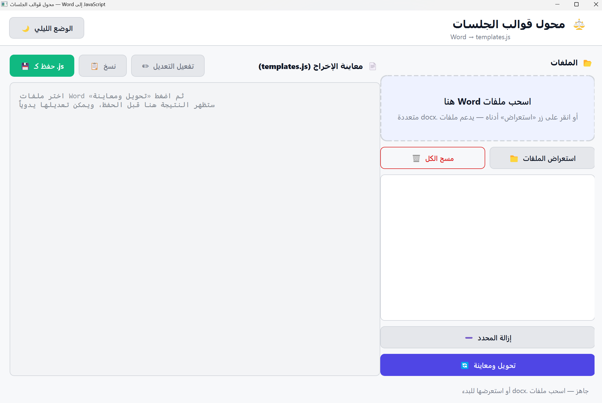

<div align="center">

<h1>⚖️ قوالب ضبط القضايا</h1>

<p><strong>منصة شاملة للنماذج والصيغ القضائية والحاسبات المتخصصة للمحاكم السعودية</strong></p>

[](https://github.com/abosalehg-ui/court-templates-sa)
[](https://github.com/abosalehg-ui/court-templates-sa/blob/main/LICENSE)
[](https://developer.mozilla.org/en-US/docs/Web/HTML)
[](https://developer.mozilla.org/en-US/docs/Web/JavaScript)

[🌐 عرض التطبيق](https://abosalehg-ui.github.io/court-templates-sa) · [🐛 الإبلاغ عن مشكلة](https://github.com/abosalehg-ui/court-templates-sa/issues)

</div>

## 📋 نظرة عامة

تطبيق ويب متكامل يوفر **أكثر من 550 نموذجاً وصيغة قضائية** جاهزة للاستخدام في المحاكم السعودية، مع مجموعة من **الحاسبات القضائية المتخصصة** والأدوات المساعدة. التطبيق يعمل بالكامل في المتصفح دون الحاجة لاتصال بالإنترنت.

### ✨ المميزات الرئيسية

- 📝 **مكتبة نماذج شاملة** - أكثر من 550 نموذجاً مصنفاً
- ⚡ **مولّد الجلسة** - توليد محضر ضبط الجلسة كاملاً من نموذج تفاعلي متعدد الخطوات
- 📜 **معالج الصكوك** - تنظيف نص الضبط القضائي: دمج الجلسات، حذف جلسات الشطب، والتصحيح الإملائي والتشكيل
- 🔍 **بحث سريع** - البحث في جميع النماذج بسهولة
- 🧮 **6 حاسبات قضائية** - أتعاب الخبرة، الميراث، تقدير الأضرار، الأضرار المرورية، مكافأة نهاية الخدمة، الديات والشجاج
- 🔢 **تفقيط الأرقام** - تحويل الأرقام إلى كتابة (11 عملة)
- ⭐ **المفضلة** - حفظ النماذج المستخدمة بكثرة
- 📜 **السجل** - الوصول السريع للنماذج الأخيرة
- 🌙 **الوضع الليلي** - راحة للعين
- 📱 **تصميم متجاوب** - يعمل على جميع الأجهزة
- 🖨️ **طباعة مباشرة** - طباعة النماذج بسهولة

---

## 📂 التصنيفات

| التصنيف | الوصف |
| --- | --- |
|  الجلسة الأولى | صيغ ونماذج خاصة بالجلسة الأولى |
|  الجلسة الثانية | صيغ ونماذج خاصة بالجلسة الثانية |
|  أسباب الحكم | أسباب الأحكام بمختلف أنواعها |
|  اختصارات صندوق الحكم | صيغ مختصرة لصندوق الحكم |
|  إفهامات بعد النطق | الإفهامات اللاحقة للنطق بالحكم |
|  التبليغ | صيغ التبليغات |
|  الصلح | صيغ الصلح |
|  سماع الشهادة | صيغ سماع الشهادات |
|  الشطب | صيغ الشطب |
|  المشاكل التقنية | حلول للمشاكل التقنية الشائعة |
|  نماذج أخرى | تصنيفات متنوعة (الدعوى، الإجابة، المرافعة، اليمين، النكول، الكفالة، الالتماس، الغياب، الاختصاص، التمويل، العقارات، وغيرها) |

---

## ⚡ مولّد الجلسة

مولّد تفاعلي لمحاضر ضبط الجلسات (صفحة `minutes.html`) يبني نص الضبط كاملاً وبصياغة قضائية سليمة نحوياً من نموذج متدرج الخطوات:

- **نوعا الجلسة:** تحضيرية (جديدة) أو منظورة سابقاً، مع صيغة المادة (167) من نظام المرافعات عند تغيّر ناظر القضية.
- **بيانات الافتتاح:** **اسم القاضي وصفته** والمحكمة (تُحفظان محلياً فلا تُعاد كتابتهما)، فتخرج فقرة الافتتاح: «لدي أنا … في المحكمة …،» — والصفة تُكتب في حقل الاسم نفسه فلا تُقحم كلمة «القاضي» في النص.
- **طريقة انعقاد الجلسة:** خياران ظاهران: «عبر الاتصال المرئي» (الافتراضي) و«حضوري». و**لا تُذكر طريقة الانعقاد في فقرة الافتتاح**، وإنما يظهر أثرها في فقرات الغياب والشطب والحالات الاستثنائية: «- بالاتصال المرئي -» مع رابط غرفة الاتصال، أو صيغة الحضور المباشر بمقر المحكمة. وخيار «عبر الاتصال المرئي (مع المستند النظامي)» بصيغة قرار رئيس المجلس الأعلى للقضاء رقم (17388) **مُخفى حالياً** مع بقاء صيغته في الكود (`SHOW_SESSION_MODE_IN_OPENING` في `js/minutes.js`) تحسّباً للحاجة إليه مستقبلاً.
- **وقت الإغلاق:** آخر بطاقة في خطوة (الأسباب والحكم)، وتنتقل لآخر خطوة متاحة في المحاضر المختصرة التي تسقط فيها هذه الخطوة؛ إذ إن **وقت افتتاح الجلسة مثبت في صفحة القضية بناجز** فإعادته في متن الضبط ازدواج، فحُذف من المتن واقتُصر على وقت الإغلاق الذي يُدخله القاضي، ويُختم به الضبط: «وأغلقت الجلسة الساعة …» مع تحويله إلى كتابة عربية.
- **الأطراف:** فرد/شركة/وقف (للمدعى عليه)، سعودي/مقيم، حضور أصالة أو بوكيل (محامٍ أو قريب مع فحص الدرجات الأربع وفق المادة 1/7 من اللائحة التنفيذية) أو ممثل نظامي، وتعدد المدعين والمدعى عليهم.
- **صيغة الحاضر بوكالة:** «(اسم الوكيل)، بصفته وكيلاً بموجب الوكالة الصادرة من (جهة الإصدار)، برقم (رقم الوكالة)» ويُلحق بها رقم رخصة المحاماة للمحامي، أو صلة القرابة لغيره. و**موضعها يختلف بحسب الطرف**: وكيل المدعى عليه تُثبت بياناته في فقرة عرض الدعوى عليه — «أ. هـ وبعرضها على (اسم الوكيل)، الحاضر بصفته وكيلاً… أجاب قائلاً:» — فلا تتكرر في فقرات الحضور، ووكيل المدعي تبقى بياناته بعد الافتتاح: «وحضر عن المدعي (اسم الوكيل)، بصفته وكيلاً…». وفي الجلسة المنظورة سابقًا — حيث لا تُعرض الدعوى — يبقى وكيل المدعى عليه في فقرة الحضور.
- **رقم هوية الوكيل وعبارة التحقق من الوكالة (المادة 51/3)** لم تعودا تُكتبان في متن الضبط: التحقق قائم لدى الدائرة عبر بوابة التحقق (وتنبيهها يظهر عند إدخال رقم الوكالة)، وحقل رقم الهوية مستور مع بقاء عمله في الكود.
- **بطاقة الهوية:** لكل طرف — الأول والإضافي على السواء — بطاقة جنسية وهوية (سعودي: الهوية الوطنية، غير سعودي: الجنسية مع رقم الإقامة، والشركة: السجل التجاري، والوقف: صك الوقفية) تُدرج في فقرة حضوره أصالةً، وتُفحص في تحذيرات الحقول الناقصة.
- **مفتاح «إدراج بيانات الطرفين (الاسم والهوية) في نص الضبط»:** **مُخفى حالياً ومُغلق**، مع بقاء عمله في الكود (`PARTY_DATA_TOGGLE_ENABLED` في `js/minutes-app.js`) تحسّباً للحاجة إليه مستقبلاً؛ لأن جدول نظام تقاضي أعلى صفحة الضبط والصك يحمل اسم الطرف ورقم هويته، فإثباتها في المتن تكرار. **ومع إغلاقه لا تُثبت فقرة الحضور أصالةً في المتن أصلاً** (لا «حضر المدعي أصالة» ولا ترقيم الأطراف)، فيتصل الافتتاح بالاطلاع على صحيفة الدعوى، وتُخفى حقول الاسم والهوية من النموذج وتسقط تحذيراتها. وتبقى فقرة الحضور مكتوبة كلما حملت ما لا يحمله الجدول: الوكيل والممثل النظامي والوكيل المرافق للحاضر أصالةً، وكذلك الغياب والتبليغ.
  - **ويبقى تحديد نوع الطرف لازماً في الحالين** (فرد/شركة، ومذكر/مؤنث)؛ لأن عليه تدور المطابقة النحوية: حضر/حضرت، والمدعي/المدعية، والمدعى عليه/المدعى عليها، وصيغ الغياب والتبليغ.
  - **ولا يشمل المفتاح بيانات الشهود**؛ فجدول تقاضي لا يحملها وإثباتها في الضبط مطلوب بالمادة (71) من نظام الإثبات، فتُثبَت دائمًا.
  - **ولا يشمل المفتاح بيانات الوكيل** — اسمه وجهة إصدار وكالته ورقمها ورخصة مزاولة المحاماة ودرجة قرابة الوكيل غير المحامي — فهذه لا يكتبها الجدول وإثباتها في الضبط مطلوب نظاماً، فتبقى مثبتة في كل الأحوال.
  - ولا أثر للمفتاح على **الأسباب والحكم**؛ فنصّهما يكتبه القاضي، وفقرات الإفهام والحضورية تستعمل «المدعي/المدعى عليه» لا الأسماء.
- **نوع الدعوى:** أول بطاقة في خطوة (الدعوى والبينات): طلب مالي أو غير مالي، ومع المالي وحده يظهر حقل **قيمة المطالبة** الذي يُشتق منه نوع الإفهام في مرحلة الحكم؛ فالطلب غير المالي لا يدخل حدّ الدعاوى اليسيرة ويبقى الحكم فيه قابلًا للاستئناف ما لم يُحدَّد غيره.
- **التسلسل الإجرائي للدعوى:** الاطلاع على صحيفة الدعوى: «جرى الاطلاع على صحيفة الدعوى ونصها : (( … )) أ. هـ» — ينسخ القاضي نصها من نظام ناجز — ثم **عرضها على المدعي ومصادقته عليها**: «وبعرضها على المدعي صادق عليها»، ويتبع اللقبُ صفةَ حضوره فيصير «**المدعي وكالة**» إن حضر عنه وكيله (لا الممثل النظامي، فالتمثيل صفة لا وكالة)، ويتبع الفعلُ جنسَ المصادِق (الوكيلة: «صادقت عليها»).
  - **«لديه إضافة»** (اختياري): إن كان للمدعي ما يضيفه على صحيفة دعواه بعد مصادقته عليها، فُتح مربع «ثم قدم النص التالي:» وأُلحق بالمصادقة: «… صادق عليها. ثم قدم النص التالي: ( … ) هكذا قدَّم.» — بمطابقة نحوية للمدعية ولوكيلتها.

  ← **عرضها على المدعى عليه وإثبات جوابه** بإحدى صوره الأربع:
  - **مذكرة الدفاع الأولى** → «وبالاطلاع على مذكرة الدفاع الأولى المقدَّمة من المدعى عليه ونصها: (( … )) أ. هـ. وبعرضها على المدعى عليه صادق عليها» — ينسخ القاضي نصها من الطلبات.
  - **إجابة شفهية رصدها كاتب الضبط** (الصيغة الافتراضية) → «وبعرضها على المدعى عليه أجاب قائلاً: … هكذا أجاب».
  - **مذكرة مكتوبة مقدمة من المدعى عليه** → «وبعرضها على المدعى عليه قدم مذكرة مكتوبة نصها: …، هكذا قدَّم».
  - **طلب مهلة للجواب في الجلسة القادمة** → صيغة موحدة بلا نص يُكتب: «وبعرضها على المدعى عليه أجاب قائلاً: اطلب مهلة لتقديم الجواب مفصلا في الجلسة القادمة، هكذا أجاب».

  وفي الصور الأربع تبقى بيانات وكيل المدعى عليه مثبتة في فقرة الجواب نفسها لا في فقرات الحضور (انظر `defendantAgentStatedInAnswer`)، ثم يأتي تكييف الجواب:
  - **إقرار** → لا موجب لتكليف المدعي بالبينة، ويُقفل باب المرافعة مباشرة.
  - **إنكار** → تكليف المدعي بالبينة (البينة على المدعي).
  - **دفع شكلي** → إثباته وعرضه على المدعي للرد عليه، ثم النظر فيه قبل الخوض في الموضوع.

  ولا يُسأل المدعي عن بينته قبل عرض الدعوى على خصمه، إلا إذا كان المدعى عليه غائباً فيُسأل مباشرة.
- **بينة المدعي:** قائمة بينات، مزيد البينة، وطلب اليمين والنكول (المواد 99 و103 من نظام الإثبات).
- **بيّنة المدعى عليه ودفوعه:** كتلة مستقلة تُفتح عند دفعه بما يحتاج إلى إثبات (كالوفاء أو الإبراء)، بقائمة بينات وشهود مستقلة.
- **سماع الشهادة:** متاح في **الجلستين** (التحضيرية والتالية)، وفق المادتين (71) و(78) من نظام الإثبات، ويشمل: سماع كل شاهد على انفراد، الإفصاح عن البيانات الشخصية (الاسم، والجنسية ورقم الهوية/الإقامة، وتاريخ الميلاد، والمهنة، والسكن — والجنسية بقائمة بحث مطبَّعة يتصدرها «سعودي»، ورقم الهوية أو الإقامة بعشرة أرقام لاتينية تُفحص كبيانات الطرفين) و**صلة الشاهد بكل خصم على حدة** ومصلحته، **رقم جوال الشاهد** (يُطبع بأرقامه وحدها بين معقوفتين `[...]` بلا عبارة تعرّف به، ليطّلع عليه القاضي عند مراجعة الضبط ويحذفه بعد نسخه في ناجز، ويبقى لديه سبيلٌ للاتصال بالشاهد إن طرأ ظرف)، **تحليف الشاهد قبل أداء الشهادة**، **تعديل الشهود وتزكيتهم** (الإمهال لإحضار المعدِّلين أو حضورهم)، و**عرض الشهود وشهادتهم على الخصم لسؤاله عن مطعنه** فيهم أو في شهادتهم.
- **الأسباب والحكم (مرحلة مستقلة):** تُلحق بالضبط بعد قفل باب المرافعة، وتستهلك مكتبة النماذج في `data/templates.js` مباشرة:
  - **الأسباب:** منتقي بحث في تصنيف (أسباب الحكم) — 148 نموذجاً، مع اقتصار افتراضي على نماذج التسبيب المنسّقة في مقدمة التصنيف (31 نموذجاً).
    والعددان يُقرآن من المكتبة عند فتح الصفحة لا من رقم ثابت في الكود، فيتحدثان تلقائياً مع كل تحديث لملف النماذج.
    والبحث **مطبَّع**: يسقط التشكيل ويوحّد الهمزات والتاء المربوطة والألف المقصورة والأرقام العربية، ويقبل عدة كلمات متفرقة في النص،
    ويقدّم ما طابق كلمته المفتاحية، ويعرض تحت كل نتيجة مقتطف الجملة التي وقع فيها البحث.
  - **منطوق الحكم:** منتقي بحث في تصنيف (اختصارات صندوق الحكم)، وصفة الحكم حضوري/غيابي.
  - **نوع الإفهام:** يُشتق تلقائياً من نوع الدعوى وقيمة المطالبة المدخلين في الخطوة السابقة (حدّ الدعاوى اليسيرة)، أو يُحدَّد يدوياً (نهائي / قابل للاستئناف / صلح / واجب التدقيق)، ونصه مأخوذ من تصنيف (إفهامات بعد النطق) فلا يُكرَّر في الكود.
  - **صفة «وقف» للمدعى عليه:** تحمل خصائص الشركة نفسها (شخصية اعتبارية لا تحضر أصالةً وإنما بوكيل أو ممثل نظامي)، وتفترق عنها في أن الحكم عليها **واجب التدقيق لزوماً لا اختياراً**، فيُثبَّت نوع الإفهام على «واجب التدقيق» وتُقفل بقية الخيارات، ولا يُكرَّر نصه إن اختير التدقيق الوجوبي معه.
  - **إجراء التدقيق الوجوبي:** لا يُسأل عنه إلا عند اختيار إفهام «واجب التدقيق»، فهو صيغته لا فقرة زائدة عليه، وله حالان من التصنيف نفسه: رفع كامل ملف الدعوى بعد مدة الاعتراض، أو إعادة القضية لمحكمة الاستئناف (قرار المحكمة العليا 19/م).

  ⚠️ حدّ الدعاوى اليسيرة المعتمد (50,000 ريال) يُحدَّد بقرار من المجلس الأعلى للقضاء وقابل للتعديل؛ يلزم التحقق منه قبل الاعتماد عليه، ويُغيَّر من الثابت `YASEERA_CLAIM_LIMIT` في `js/minutes.js`.
- **الحالات الخاصة:** الشطب واعتبار الدعوى كأن لم تكن (المادة 55)، عدم التبلّغ وإعادة التبليغ، غياب المدعى عليه عن أداء اليمين، والحالات الاستثنائية لحضور المدعي.
- **غياب المدعى عليه المتبلّغ:** «وقد تبلَّغ المدعى عليه ولم يحضر هو ولا من يمثله، بمهمة التبليغ رقم (…)، ولم يودع مذكرة بدفاعه بناء على ما قررته المادة الخامسة والأربعون من نظام المرافعات الشرعية» — بمطابقة نحوية للمدعى عليها. **وموضعها في الجلسة التحضيرية بعد رصد الدعوى** ومصادقة المدعي عليها (وبعد إضافته إن وُجدت) لا مع فقرات الحضور، إذ لا يستقيم إثبات غيابه قبل رصد ما غاب عنه؛ وفي الجلسة المنظورة سابقًا — ولا رصد للدعوى فيها — تبقى في موضعها مع فقرات الحضور. ويُصرَّح حينئذ بلقب المدعي عند سؤاله عن بينته («وبسؤال المدعي عن بينته») بدل الضمير، لئلا يعود على المدعى عليه المذكور قبله.
- **مزايا مساعدة:** مطابقة نحوية كاملة (التذكير والتأنيث والتثنية)، معاينة حية مع تحرير يدوي، تحذير الحقول الناقصة، حفظ مسودة تلقائي واسترجاعها، مؤقّت قياس سرعة التعبئة (قابل للإيقاف)، نسخ وطباعة.

> **فكرة المولّد وإعداد الصياغ القضائية:** فضيلة القاضي/ زياد بن محمد البابطين

---

## 📜 معالج الصكوك

أداة تنظيف لنصوص الضبوط القضائية (صفحة `sakk.html`): يُلصق نص الضبط الخام أو يُفتح من ملف `.txt`، فيخرج منقّحاً مع عرض مقارنة بين الأصل والمعدَّل وإحصاءات لكل عملية.

**المراحل الست بالترتيب:**

1. **توحيد المسافات** — كل مسافتين فأكثر تصيران مسافة واحدة.
2. **ضبط النقطتين** — حذف المسافة قبل «:».
3. **حذف الأسطر الفارغة** — طيّ الفراغات بين الفقرات.
4. **دمج الجلسات** — استبدال فواصل الجلسات المتتابعة بعبارة «وفي جلسة أخرى» وفق **أحد عشر نمطاً** محدداً: الختام بالساعة، ورفع الجلسة للنطق بالحكم، والنكول، وللدراسة والاطلاع، وصيغ «وبالله التوفيق» (ومنها صيغة انعقاد الجلسة عن بُعد بقرار المجلس الأعلى للقضاء)، وصيغ رفع الجلسة. والأنماط مرتبة الأطول أولاً حتى لا يبتلع نمط عام ما يخص نمطاً أدق، والأنماط التي لها مقدمة معنوية (كسبب رفع الجلسة) تحافظ عليها فلا تُحذف مع الفاصل.
5. **التصحيح الإملائي والتشكيل** — قاموس من **٢١٨ مدخلاً** يصحّح الهمزات والتاء المربوطة والصيغ الشائعة ويضبط بعض الكلمات بالشكل، مرتَّب تنازلياً بطول الكلمة الخاطئة حتى لا تلتقط كلمة قصيرة جزءاً من كلمة أطول، وبحدود كلمات عربية مكتوبة يدوياً لأن `\b` لا تعمل مع الحروف العربية. وهذه المرحلة **اختيارية** تُطفأ من مفتاح في الصفحة.
   - **دمج احتياطي:** بعد التصحيح تُلتقط فواصل جلسات لم تغطها الأنماط المحددة، بشرط أن يكون المقطع بين «رفعت الجلسة» و«حضر» أقصر من ١٧ كلمة وأن يحوي إحدى عبارات الختام المعروفة، ومع تجاهل ما سبق دمجه منعاً للعدّ المزدوج.
6. **حذف جلسات الشطب** — تُحذف الجلسة التي قُررَ فيها شطب الدعوى كاملةً، من آخر بداية جلسة قبل قرار الشطب إلى صيغة ختامها. ويُقيَّد البحث عن صيغة الختام بنطاق الجلسة نفسها (حتى بداية الجلسة التالية) حتى لا يلتهم الحذف جلسة صحيحة بعدها، فإن تعذّر تحديد النهاية بأمان **تُترك الجلسة كما هي ويُنبَّه المستخدم** بدل الحذف على غير يقين.

**العرض والمخرجات:** مقارنة جنباً إلى جنب بين النص الأصلي والمعدَّل، بثلاثة تظليلات — موضع دمج جلسات، وموضع حذف جلسة شطب، وكلمة مصححة — وستة عدادات للعمليات. والناتج يُنسخ أو يُحفظ ملفاً نصياً أو يُطبع، مع حفظ تلقائي للنص على الجهاز واسترجاعه في زيارة لاحقة.

> ⚠️ **حدود الأداة:** الاستبدالات متسلسلة على النص نفسه، فقد تُصحَّح كلمة ثم يعيد مدخل لاحق تصحيحها؛ والأداة **مساعدة لا بديل عن مراجعة القاضي** للنص قبل اعتماده.

> **المصدر:** نُقل المحرك من [معالج الصكوك القضائية](https://github.com/abosalehg-ui/sakk-processor) (رخصة MIT) بسلوكه كما هو، وأُعيد كساؤه بثيم المشروع، وفُصل منطقه عن الواجهة ليصير مغطى بالاختبارات.

---

## 🧮 الحاسبات القضائية

### 1️⃣ حاسبة أتعاب الخبرة 💼
توزيع أتعاب الخبير القضائي بين الأطراف حسب نسبة المسؤولية، مع حساب النسب تلقائياً من المبلغ المطلوب والمحكوم به.

### 2️⃣ حاسبة تقدير الأضرار ⚠️
احتساب قيمة التعويض المستحق بناءً على قيمة الضرر ونسبة المسؤولية، مع تفقيط النتيجة.

### 3️⃣ حاسبة الأضرار المرورية 🚗
جمع تقدير التلفيات والرسوم وأضرار شحن المركبة في مجموع كلي مع التفقيط.

### 4️⃣ حاسبة الديات والشجاج 📜
حاسبة تفاعلية تشمل **193 عضواً ومنفعةً وشجة** من جدول مقادير الديات، مع:
- خيار الجنس (رجل / امرأة)
- نوع الجناية (عمد وشبهه / خطأ)
- وحدة الدية (ريال / إبل)
- بحث فوري وتفقيط تلقائي للنتائج

> **المصدر:** الأمر السامي رقم 43108 وتاريخ 2/10/1432هـ، والمبني على قرار الهيئة العامة للمحكمة العليا رقم (2) في 14/7/1431هـ.

5️⃣ حاسبة مكافأة نهاية الخدمة 💰
احتساب مكافأة نهاية الخدمة وفق المواد (84، 85، 87، 80) من نظام العمل السعودي، مع إدخال مدة الخدمة بالتواريخ أو يدوياً، وتفقيط النتيجة.

### 6️⃣ حاسبة المواريث 📊
حساب التركات وفق الشريعة الإسلامية.

---

## 🚀 التشغيل والتنزيل

### الطريقة الأولى: استخدام Git (موصى بها) 🌟

```bash
# استنساخ المشروع
git clone https://github.com/abosalehg-ui/court-templates-sa.git

# الانتقال إلى مجلد المشروع
cd court-templates-sa

# افتح index.html في المتصفح مباشرة
# أو شغّل خادماً محلياً (اختياري):
python -m http.server 8000
# ثم افتح: http://localhost:8000
```

### الطريقة الثانية: تنزيل مباشر 📥

1. اضغط على زر **Code** الأخضر في صفحة المخزن
2. اختر **Download ZIP**
3. فك ضغط الملف
4. افتح `index.html` في المتصفح

### الطريقة الثالثة: الاستخدام عبر الإنترنت 🌐

ادخل مباشرة على الرابط:  
[https://abosalehg-ui.github.io/court-templates-sa](https://abosalehg-ui.github.io/court-templates-sa)

### إضافة: أداة تحويل النماذج 🛠️

```bash
# تثبيت الاعتماديات (مرة واحدة)
pip install -r tools/requirements.txt

# تشغيل أداة Python
python tools/wordtotemplates.py
```

النسخ التنفيذية الجاهزة (EXE) تُنشر عبر صفحة  
[**GitHub Releases**](https://github.com/abosalehg-ui/court-templates-sa/releases)  
مع بصمة تحقق (SHA256) لكل إصدار — يُنصح بالتحميل منها حصراً بدل الروابط الخارجية.

---

## 🧪 الاختبارات

دوال الحساب (المواريث، نهاية الخدمة، التفقيط) معزولة في `js/calc.js`، ودوال صياغة محاضر الجلسات معزولة في `js/minutes.js`، ومنطق معالجة الصكوك معزول في `js/sakk.js`، وكلها مغطاة باختبارات آلية تعمل تلقائياً مع كل تعديل عبر GitHub Actions:

```bash
# يتطلب Node.js 18 فأحدث — بلا أي اعتماديات خارجية
npm test
```

---

## 🚢 النشر

الموقع **static بالكامل** بلا خطوة بناء وبلا خادم، لذا يعمل على أي استضافة ملفات ثابتة.

### GitHub Pages (الرابط الرسمي)

ينشر تلقائياً مع كل دفعة إلى `main` عبر `.github/workflows/deploy-pages.yml`.

### Vercel (اختياري — للمعاينة قبل الدمج)

يُقرأ الإعداد من `vercel.json` مباشرة، ولا يحتاج أي أمر بناء:

1. من لوحة Vercel: **Add New → Project** ثم اختر هذا المستودع.
2. اترك **Framework Preset** على `Other` — الإعداد في `vercel.json` يتكفّل بالباقي.
3. **Deploy**.

ما يضيفه `vercel.json`:

- تخزين دائم لملفات الخطوط (`immutable`) بدل إعادة تنزيلها مع كل زيارة.
- رؤوس أمان: `Content-Security-Policy` و `X-Content-Type-Options` و `Referrer-Policy` و `Permissions-Policy` — وهي رؤوس **لا يمكن ضبطها على GitHub Pages**.

> **ملاحظة:** ملفات أداة Python موضوعة في `tools/` قصداً. وجود `requirements.txt` في جذر المستودع يجعل Vercel يصنّف المشروع تطبيق Python فيفشل النشر برسالة `No python entrypoint found`.

---

## 📖 صيغة بيانات النماذج (للمساهمين)

ملف `data/templates.js` يعرّف كائن `templatesData`، مفاتيحه أسماء التصنيفات وقيمه مصفوفات نماذج:

```js
const templatesData = {
    "اسم التصنيف": [
        {
            "num": "1",              // رقم النموذج داخل التصنيف (نص) — يُستخدم مفتاحاً ثابتاً للمفضلة والسجل
            "keyword": "الاختصار",   // الكلمة المفتاحية المعروضة في الجدول
            "content": "نص النموذج" // المحتوى الكامل (يدعم أسطراً متعددة بـ \n)
        }
    ]
};
```

> ⚠️ حافظ على ثبات قيمة `num` عند تعديل النماذج القائمة؛ فمفضلة المستخدمين وسجلهم يعتمدان عليها.

---

## 🤝 المساهمة في المشروع

المساهمات مرحب بها وتساعد في تطوير المشروع. اتبع الخطوات التالية:

```bash
# 1. عمل Fork للمشروع من زر Fork في أعلى الصفحة

# 2. استنساخ نسختك
git clone https://github.com/YOUR-USERNAME/court-templates-sa.git
cd court-templates-sa

# 3. إنشاء فرع جديد للتعديلات
git checkout -b feature/your-feature-name

# 4. إجراء التعديلات وحفظها
git add .
git commit -m "وصف التعديل بالعربية أو الإنجليزية"

# 5. رفع التعديلات إلى نسختك
git push origin feature/your-feature-name

# 6. افتح Pull Request من صفحة المخزن على GitHub
```

### أنواع المساهمات المرحب بها:
- 🐛 إصلاح الأخطاء (Bug fixes)
- 📝 إضافة نماذج وصيغ جديدة
- ✨ تحسينات في الواجهة أو الأداء
- 📖 تحسين التوثيق
- 🌐 إصلاحات الترجمة أو التنسيق

---

## 🛠️ التقنيات المستخدمة

- **HTML5** - هيكل الصفحة
- **CSS3** - التنسيق والتصميم (مع دعم RTL)
- **JavaScript (Vanilla)** - الوظائف والتفاعل دون مكتبات خارجية
- **LocalStorage** - حفظ المفضلة والسجل والإعدادات محلياً
- **خطوط محلية** - خط Tajawal وخط Amiri مستضافان داخل المشروع (يعمل التطبيق دون إنترنت فعلياً)
- **Node.js (node:test)** - اختبارات آلية لدوال الحساب دون اعتماديات
- **Python** - أداة تحويل نماذج Word إلى بيانات JavaScript

---

## 📸 لقطات الشاشة

| الواجهة الرئيسية | الوضع الليلي |
| --- | --- |
|  |  |

| حاسبة المواريث | التفقيط |
| --- | --- |
|  |  |

| حاسبة أتعاب الخبرة | حاسبة تقدير الأضرار |
| --- | --- |
|  |  |

| حاسبة الأضرار المرورية | حاسبة الديات والشجاج |
| --- | --- |
|  |  |

| أداة تحويل جداول الورد إلى بيانات js |
| --- |
|  |

---

## 📄 هيكل المشروع

```
court-templates-sa/
├── index.html              # هيكل الصفحة الرئيسي
├── minutes.html            # صفحة مولّد الجلسة
├── sakk.html               # صفحة معالج الصكوك
├── README.md               # هذا الملف
├── LICENSE                 # رخصة MIT
├── package.json            # سكربت الاختبارات (npm test)
├── vercel.json             # إعداد النشر على Vercel (static + رؤوس أمان وتخزين)
├── .vercelignore           # ملفات مستثناة من النشر
├── css/
│   ├── style.css           # التنسيقات
│   ├── minutes.css         # أنماط صفحة مولّد الجلسة
│   ├── sakk.css            # أنماط صفحة معالج الصكوك
│   └── fonts.css           # تعريفات الخطوط المحلية
├── js/
│   ├── calc.js             # دوال الحساب الصافية (مواريث، نهاية خدمة، تفقيط)
│   ├── minutes.js          # محرك صياغة محاضر الجلسات (دوال صافية)
│   ├── minutes-app.js      # واجهة مولّد الجلسة والتفاعل
│   ├── sakk.js             # محرك معالجة الصكوك (دوال صافية)
│   ├── sakk-app.js         # واجهة معالج الصكوك والتفاعل
│   └── app.js              # كود الواجهة والتفاعل
├── data/
│   ├── templates.js        # بيانات النماذج والقوالب القضائية
│   ├── diyat-data.js       # بيانات جدول الديات والشجاج (193 عنصراً)
│   └── sakk-corrections.js # قاموس التصحيح الإملائي والتشكيل (218 مدخلاً)
├── fonts/                  # ملفات خطوط Tajawal و Amiri (woff2)
├── tests/
│   ├── calc.test.js        # اختبارات دوال الحساب
│   ├── minutes.test.js     # اختبارات محرك صياغة المحاضر
│   └── sakk.test.js        # اختبارات محرك معالجة الصكوك
├── tools/
│   ├── wordtotemplates.py  # أداة تحويل جداول الورد إلى بيانات JS
│   └── requirements.txt    # اعتماديات أداة Python مثبتة الإصدارات
└── screenshots/            # لقطات الشاشة
```

---

## ⚠️ إخلاء المسؤولية

هذا التطبيق أداة **مساعدة وإرشادية** وليس بديلاً عن الاجتهاد القضائي أو الاستشارة القانونية المتخصصة.

---

## 📜 الترخيص

هذا المشروع مرخص تحت [MIT License](https://github.com/abosalehg-ui/court-templates-sa/blob/main/LICENSE).

---
 
## 👨‍💻 المطور
<div align="center">
<p><strong>عبدالكريم صالح العبود</strong></p>

[](mailto:abo.saleh.g@gmail.com)
[](https://github.com/abosalehg-ui)

</div>

## 🙏 شكر وتقدير

- **فضيلة القاضي/ ماجد بن صالح المحيميد** - جمع وتهذيب النماذج القضائية
- **فضيلة القاضي/ سليمان بن متعب الشمري** - إعداد حاسبة أتعاب الخبرة
- **فضيلة القاضي/ عبدالعزيز بن عبدالرزاق الغديان التميمي** (قاضي استئناف متقاعد) - إعداد جدول مقادير الديات والشجاج
- **فضيلة القاضي/ زياد بن محمد البابطين** - فكرة مولّد الجلسة وإعداد صياغه القضائية
- **كل من ساهم** في مراجعة النماذج أو اقتراح التحسينات
---
 
<div align="center">
صُنع بعناية لخدمة العاملين في القطاع القضائي- المدينة المنورة
 
**⭐ إذا أعجبك المشروع، لا تنسَ إضافة نجمة! ⭐**
 
</div>
